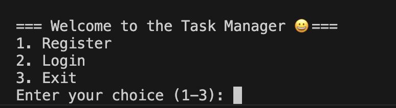
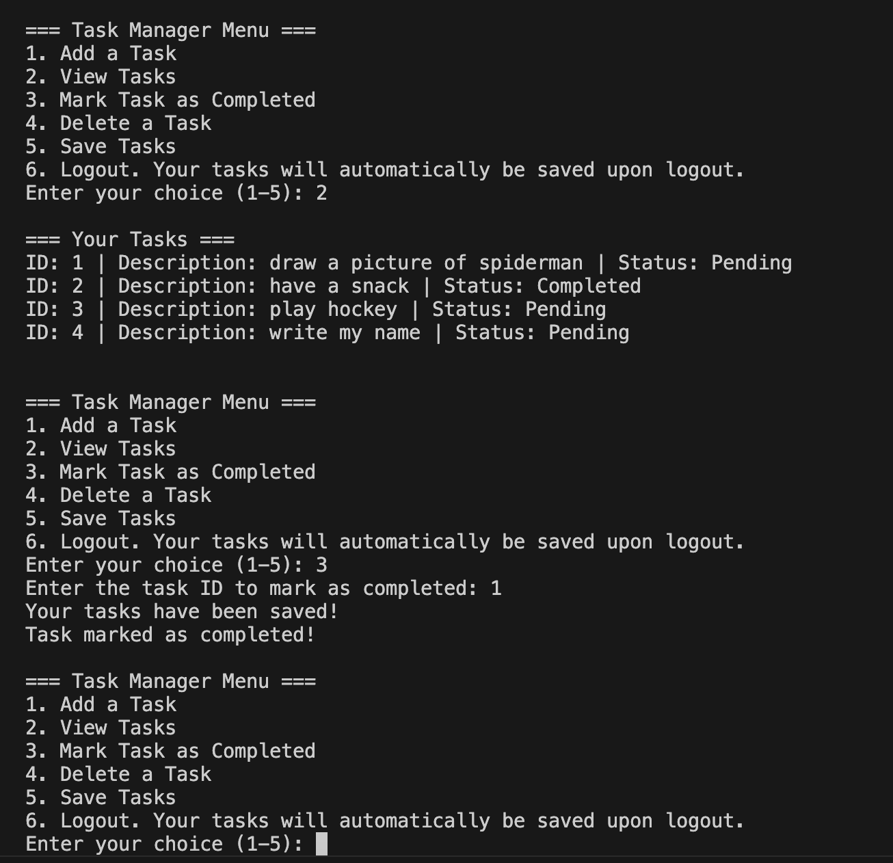

# task_manager

## Description
This is a beginner command-line application using Python to maintain a running list of tasks with the basic CRUD functions.  A user must be authenticated via registration and login in to see the full menu and access their tasks.  Python regex is used to verify password.
## Running the Program
Python 3 is required.  Only built-in libaries are used, so no additional installation is required.  Open the file in an IDE, open a terminal and run "python proj2_task_manager.py" in command line and the menu will appear.
## Usage
A new user can create log in credentials and access their own lists of tasks.  They can add tasks, mark them as completed, delete and save them.  As well they can view a list of current tasks.  If they log out, they can log back in to see their tasks and use the program.  A new user can create log in credentials and access their own lists of tasks.  They can add tasks, mark them as completed, delete them and view a list of current tasks.
## Resources/Development
Initially, the functions were developed and tested in google colab notebooks before being copied over to VS Code for final .py file.  Watching class videos and researching Python on W3 Schools was helpful to understand how .json files could be used to store the key value pairs and how to implement regex for password management.
## Further Development
This application should have a more professional user interface possibly using a Python library.  More functions like schedules and task due dates, user notifications could be developed.  As the data scales, other plans would need to be made for database management, especially with multiple users.  Perhaps limits of number of tasks stored should be utilized.  There should be a function for a user who forgets their login credentials.
## Testing
Code blocks were tested in increments in a colab notebook by calling the function and passing arguments if applicable and printing the results.  Once each function worked properly, testing involved both direct function calls in notebook and testing the full application using the CLI.
## Links and Visuals
Github Repository: https://github.com/aliehs111/task_manager

